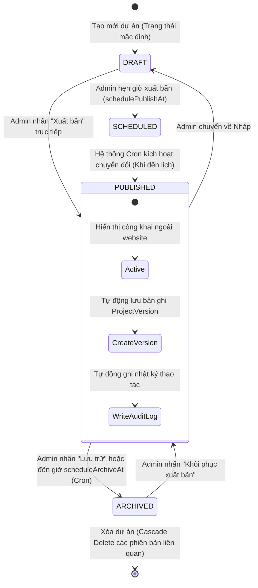
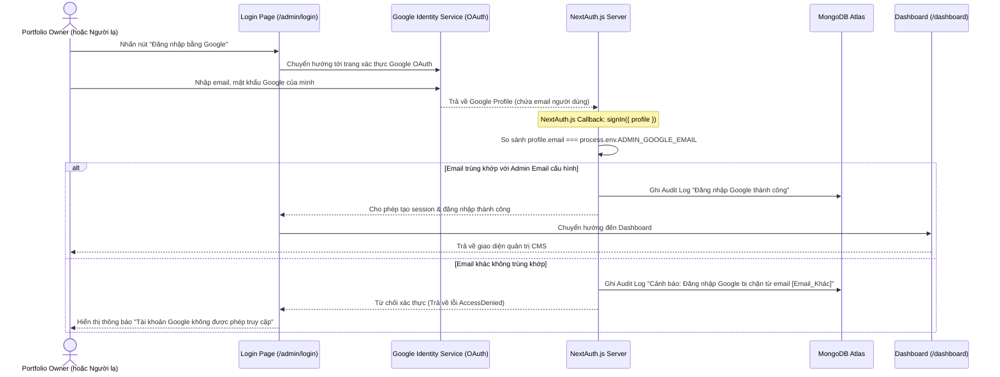
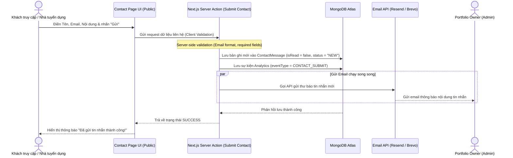
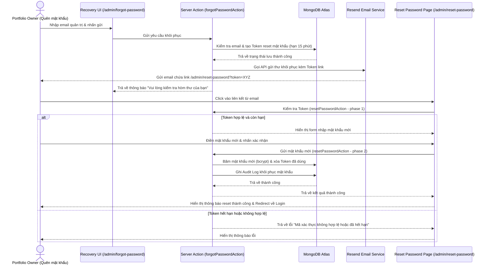

# User Flows Diagrams

Tài liệu này trình bày các sơ đồ luồng người dùng (User Flows) chi tiết mô tả sự
tương tác giữa các tác nhân và hệ thống cho các luồng nghiệp vụ cốt lõi.

---

## 1. Vòng đời Trạng thái Nội dung (Content Lifecycle Flow)

Sơ đồ dưới đây mô tả luồng chuyển đổi trạng thái của thực thể Dự án (`Project`)
từ khi tạo bản nháp đến lúc xuất bản và lưu trữ lịch sử:



---

## 2. Xác thực Đăng nhập & Bảo vệ Định tuyến (Admin Auth & Route Guard Flow)

### 2.1. Bảo vệ Định tuyến chung (General Route Guard)

Mô tả cách Next.js Middleware và NextAuth.js ngăn chặn truy cập trái phép vào
Dashboard và API quản trị:

```mermaid
sequenceDiagram
    actor Admin as Portfolio Owner
    participant Mid as Next.js Middleware (middleware.ts)
    participant Auth as NextAuth.js Session Check
    participant Dash as Dashboard UI / Server Action
    participant Login as Login Page (/admin/login)

    Admin->>Mid: Truy cập /dashboard hoặc gọi Server Action quản trị
    Active/Secure Route Check
    Mid->>Auth: Kiểm tra token hợp lệ trong cookies

    alt Session hợp lệ (Authenticated)
        Auth-->>Mid: Trả về Token xác thực thành công
        Mid->>Dash: Chuyển tiếp request đến Dashboard / Thực thi Action
        Dash-->>Admin: Trả về giao diện dashboard / kết quả thực thi
    else Session không hợp lệ / Chưa đăng nhập (Unauthenticated)
        Auth-->>Mid: Token trống hoặc hết hạn
        Mid->>Login: Redirect 302 về trang đăng nhập
        Login-->>Admin: Hiển thị form đăng nhập
    end
```

### 2.2. Đăng nhập qua Google OAuth 2.0 (Google OAuth Sign-In Flow)

Mô tả quy trình đăng nhập bằng Google và cách thức kiểm tra tính hợp lệ của địa
chỉ email để bảo vệ tài khoản Single-Admin:



---

## 3. Gửi Liên hệ & Thông báo Email (Contact Form & Notification Flow)

Quy trình gửi tin nhắn từ Khách truy cập đến khi hệ thống lưu trữ và gửi email
cảnh báo tự động cho Portfolio Owner:



---

## 4. Khôi phục Mật khẩu qua Email (Password Recovery Flow)

Quy trình gửi liên kết đặt lại mật khẩu và thực hiện reset mật khẩu bằng Token
xác thực:


