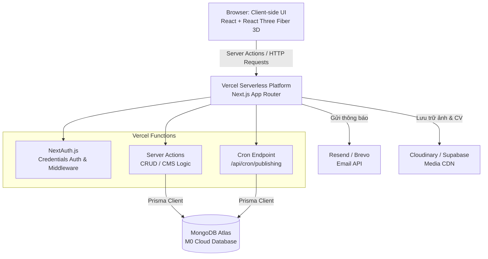

# System Architecture

## 1. Mô hình Tổng thể (Overall Architecture)

Hệ thống tuân theo kiến trúc **Serverless Full-stack** hiện đại được tối ưu hóa
hoàn toàn cho nền tảng đám mây **Vercel** và cơ sở dữ liệu **MongoDB Atlas**. Dự
án loại bỏ máy chủ backend truyền thống chạy 24/7 (như Express.js hay NestJS).
Thay vào đó, toàn bộ logic nghiệp vụ (CRUD, bảo mật, tương tác cơ sở dữ liệu)
được thực thi dưới dạng các **Serverless Functions** (API Routes và Server
Actions) của Next.js, giúp tối ưu hóa tài nguyên và đảm bảo vận hành **miễn phí
hoàn toàn (Zero-Cost)**.

---

## 2. Các Phân hệ Kiến trúc Cốt lõi (Core Architecture Modules)

### 2.1. Phân hệ Bảo mật & Xác thực (Security & NextAuth)

- **Cơ chế:** Sử dụng thư viện **NextAuth.js** với cấu hình
  `CredentialsProvider`. Do hệ thống chỉ có một quản trị viên duy nhất, tài
  khoản sẽ được khởi tạo mặc định (seeding).
- **Bảo vệ Routes (Route Protection):**
  - Sử dụng **Next.js Middleware** (`middleware.ts`) chặn ở mức định tuyến đối
    với mọi request gửi tới các trang CMS quản trị `/admin/*` và Dashboard
    `/dashboard/*`.
  - Các Server Actions ghi dữ liệu được kiểm tra phiên đăng nhập (Session) trực
    tiếp thông qua hàm `getServerSession()` trước khi thực hiện truy vấn cơ sở
    dữ liệu.

### 2.2. Cơ chế Hẹn giờ Xuất bản (Scheduled Publishing Architecture)

- **Luồng hoạt động:**
  1. Admin cấu hình thời gian xuất bản (`schedulePublishAt`) hoặc ẩn
     (`scheduleArchiveAt`) cho một dự án.
  2. Một Vercel Cron Job (hoặc cron scheduler ngoài) được thiết lập để gửi HTTP
     POST request định kỳ (ví dụ: mỗi 15 phút) tới endpoint
     `/api/cron/publishing`.
  3. API này sử dụng Prisma Client truy vấn các bản ghi `Project` thỏa mãn điều
     kiện thời gian và tự động đổi trạng thái hiển thị (`state` chuyển sang
     `PUBLISHED` hoặc `ARCHIVED`), đồng thời làm mới cache tĩnh của trang chi
     tiết dự án (`revalidatePath`).

### 2.3. Quản lý Phiên bản & Audit Log (Versioning & Auditing)

- **Ghi nhật ký:** Mỗi hành động CRUD của Admin trên Dashboard sẽ kích hoạt một
  hàm Helper `writeAuditLog()`. Hàm này lưu thông tin chi tiết (ai thực hiện,
  hành động gì, IP của ai) vào bảng `AuditLog` của MongoDB Atlas.
- **Tạo phiên bản:** Khi Admin xuất bản hoặc lưu phiên bản mới của dự án, hệ
  thống nhân bản dữ liệu hiện tại và lưu vào bảng `ProjectVersion` liên kết với
  dự án đó qua khóa ngoại `projectId` với hành động xóa liên đới
  (`onDelete: Cascade`).

---

## 3. Luồng dữ liệu (Data Flow)

1. **Client (Browser):**
   - Người dùng tải các trang tĩnh hoặc SSR từ Vercel CDN.
   - Các tương tác đồ họa 3D (React Three Fiber & Drei) được render trực tiếp
     trên GPU của Client.
2. **Next.js Server (Serverless):**
   - Tiếp nhận tương tác qua **Server Actions**.
   - Kiểm tra quyền bảo mật thông qua NextAuth.js.
3. **Database Layer:**
   - Sử dụng **Prisma Client (sinh tự động tại `src/generated/prisma`)** kết nối
     trực tiếp đến MongoDB Atlas.
   - Dữ liệu được truy vấn và trả về trực tiếp cho Server Actions để render UI
     phía Server, loại bỏ độ trễ gọi REST API.

---

## 4. Môi trường Triển khai (Deployment Ecosystem)

- **Môi trường:** Triển khai tự động (CI/CD) qua Git integration của Vercel. Mỗi
  khi push lên nhánh `main`, Vercel tự động build và deploy lên môi trường
  Production.
- **Quản lý Package:** Sử dụng `pnpm` để tối ưu hóa thời gian cài đặt thư viện
  và lưu trữ đĩa cứng cục bộ.
