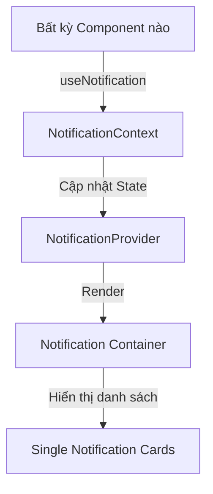

# Tài liệu Thiết kế Đặc tả Hệ thống Thông báo (Notification System Specification)

Tài liệu này định nghĩa thiết kế kiến trúc, cấu trúc thành phần, phong cách
thiết kế giao diện (Liquid Glass) và giao thức tích hợp của Hệ thống Thông báo
(Toast Notification) dùng chung cho toàn hệ thống **MyPortfolio**.

---

## 1. Tổng quan (Overview)

Hệ thống thông báo là một thành phần giao diện động (Client-side interactive UI
Component) cho phép hiển thị các phản hồi tức thời từ hệ thống (lỗi đăng nhập,
lưu dự án thành công, bài viết cập nhật...) mà không làm gián đoạn trải nghiệm
cuộn và đọc của người dùng.

Hệ thống này được bọc toàn cục thông qua React Context và hỗ trợ:

- Xếp chồng nhiều thông báo cùng lúc (stacked notifications).
- Tự động biến mất sau thời gian chờ (auto-dismiss).
- Tạm dừng thời gian đếm ngược khi người dùng rê chuột qua (pause-on-hover).
- Thích ứng toàn diện với giao diện sáng/tối (Dual-theme) và giao diện di động
  (Responsive mobile layout).

---

## 2. Thiết kế Kiến trúc (Architecture Design)

Hệ thống bao gồm ba phần chính:

### 2.1. Quản lý trạng thái (NotificationContext & Hook)

Context quản lý danh sách các thông báo đang hoạt động (`NotificationItem[]`).
Mỗi thông báo gồm có:

- `id` (string): Định danh duy nhất (UUID hoặc timestamp).
- `type` ('success' | 'error' | 'warning' | 'info'): Loại thông báo.
- `message` (string): Tiêu đề ngắn gọn của thông báo.
- `description` (string, optional): Chi tiết mô tả thêm.
- `duration` (number, optional): Thời gian tự đóng (mili-giây), mặc định
  `4000ms`. Nếu là `0` hoặc `null` thì không tự đóng.

Hook `useNotification()` xuất ra hàm `showNotification(item)` giúp kích hoạt
thông báo từ bất kỳ đâu.

### 2.2. Thành phần giao diện (Notification Component)

Được chia làm 2 lớp:

1. **NotificationContainer**: Vị trí cố định (fixed) trên màn hình để gom các
   thông báo.
2. **NotificationCard**: Thẻ thông báo đơn lẻ, chứa các biểu tượng SVG tương ứng
   với loại thông báo, văn bản thông tin, và nút đóng "X".

---

## 3. Visual & Style Design (Liquid Glass)

Tuân thủ nguyên tắc thiết kế **Liquid Glass (Kính mờ chảy)** từ tài liệu hướng
dẫn giao diện `docs/ui/ui-guidelines.md` và các skill thiết kế `.agents`:

### 3.1. Thiết kế Kính mờ (Glassmorphism)

Sử dụng các CSS Variables của hệ thống để tạo hiệu ứng phản chiếu ánh sáng và
làm mờ nền:

- Nền: `var(--color-bg-card)` kết hợp `backdrop-filter: blur(12px)`.
- Viền: `1px solid var(--color-border-glass)`.
- Bóng đổ: `var(--box-shadow-glass)`.

### 3.2. Màu sắc & Biểu tượng SVG tùy chỉnh

Mỗi loại thông báo có một tông màu nhấn cụ thể và một biểu tượng SVG được vẽ tỉ
mỉ không dùng font-icon để tránh tải thêm thư viện ngoài:

- **Thành công (success)**: Màu xanh lá `var(--color-success)`. Biểu tượng dấu
  tick tròn.
- **Lỗi (error)**: Màu đỏ `var(--color-error)`. Biểu tượng dấu chấm than trong
  hình tròn/tam giác.
- **Cảnh báo (warning)**: Màu cam `var(--color-warning)`. Biểu tượng dấu chấm
  than cảnh báo.
- **Thông tin (info)**: Màu xanh dương `var(--color-info)`. Biểu tượng chữ "i"
  cách điệu.

### 3.3. Hiệu ứng động (Animations)

- **Hiệu ứng xuất hiện (Slide In)**: Thẻ thông báo trượt nhẹ vào từ bên phải
  (trên Desktop) hoặc trượt từ dưới lên (trên Mobile) bằng hàm số Bezier mượt mà
  (`cubic-bezier(0.16, 1, 0.3, 1)` trong khoảng 400ms).
- **Hiệu ứng biến mất (Fade Out)**: Mờ dần và thu nhỏ kích thước khi đóng để
  tránh dồn thẻ giật cục.
- **Tương tác vi mô (Hover)**: Khi rê chuột qua, thẻ sẽ dừng đếm ngược tự đóng,
  viền phát sáng nhẹ hơn và tăng kích thước 1.01x.

---

## 4. Tích hợp & Kiểm thử (Integration & Verification)

### 4.1. Đăng ký Context toàn cục

Thêm `NotificationProvider` vào phần ngoài cùng của ứng dụng trong `layout.tsx`
(bên dưới phần Session Auth của NextAuth).

### 4.2. Kịch bản nghiệm thu thủ công

1. Nhấp kích hoạt liên tục nhiều thông báo để xem tính năng xếp chồng tự động
   dồn hàng.
2. Hover chuột vào một thông báo và chờ quá thời gian mặc định, đảm bảo thông
   báo đó không bị ẩn đi cho đến khi rời chuột ra ngoài.
3. Chuyển đổi Light/Dark mode để kiểm tra độ tương phản văn bản đạt tối thiểu
   4.5:1 và độ trong suốt của hiệu ứng kính mờ.
4. Co giãn kích thước trình duyệt sang Mobile viewport để xác nhận thông báo tự
   động chuyển sang căn giữa ở đáy màn hình.
