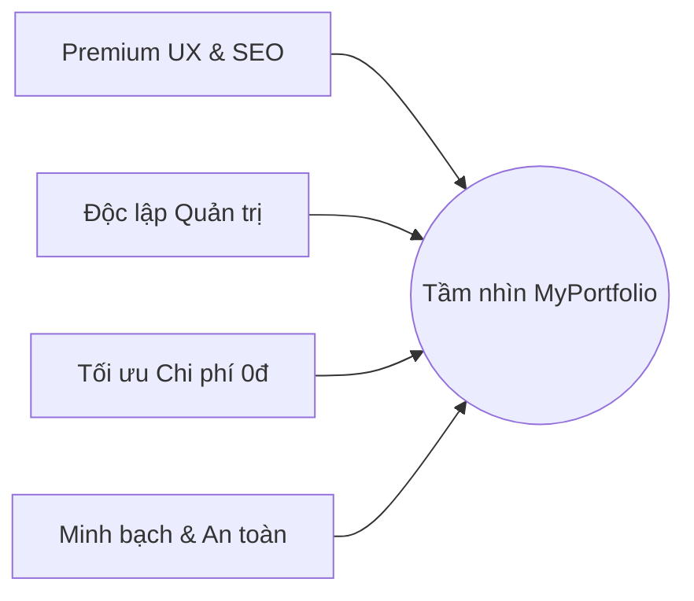

# Product Vision — MyPortfolio

Tài liệu này định nghĩa tầm nhìn sản phẩm, bối cảnh bài toán, giải pháp và lộ
trình phát triển dài hạn của hệ thống **MyPortfolio**.

---

## 1. Tuyên bố Sản phẩm (Product Statement)

- **Tên sản phẩm:** MyPortfolio
- **Định vị cốt lõi:** _"Premium Serverless Portfolio & Content Management
  System"_
- **Slogan:** _"Nâng tầm thương hiệu cá nhân với trải nghiệm 3D cao cấp và hệ
  quản trị nội dung an toàn, không tốn chi phí."_

---

## 2. Vấn đề & Cơ hội giải quyết (Problem & Opportunity)

### 2.1. Nỗi đau hiện tại (Pain Points)

- **CV PDF truyền thống nhàm chán:** Thiếu tính tương tác, không thể hiện hết
  tính sáng tạo và năng lực lập trình thực tế của ứng viên công nghệ.
- **Website tĩnh khó cập nhật:** Nhiều lập trình viên tự code trang cá nhân,
  nhưng mỗi khi đạt chứng chỉ mới, hoàn thành dự án mới hay thay đổi mô tả kinh
  nghiệm, họ phải sửa code trực tiếp và triển khai (deploy) lại rất bất tiện.
- **Chi phí duy trì VPS/Hosting:** Các website cá nhân thường ít tương tác nhưng
  vẫn tốn chi phí thuê máy chủ hàng tháng, hoặc nếu dùng dịch vụ miễn phí thì
  thường xuyên bị tắt nguồn (Sleep/Cold Start) khiến tốc độ tải trang lần đầu
  cực kỳ chậm.
- **Thiếu khả năng đo lường:** Không biết nhà tuyển dụng thực sự quan tâm đến
  phần nào trên hồ sơ, hoặc file CV có được tải xuống hay không.

### 2.2. Giải pháp của MyPortfolio

MyPortfolio cung cấp một website hiển thị cá nhân có tính tương tác 3D Premium
UX kết hợp với hệ quản trị **Headless CMS** riêng biệt được tối ưu hóa cho môi
trường Serverless.

- **Tải trang tức thì:** Sử dụng Static Generation kết hợp Caching.
- **Quản trị linh hoạt:** Người sở hữu cập nhật toàn bộ thông tin qua Dashboard
  mà không cần viết code.
- **Chi phí 0đ:** Tận dụng tối đa các gói Free Tier đám mây hoạt động ổn định
  24/7.

---

## 3. Các Trụ cột Tầm nhìn Cốt lưỡng (Vision Pillars)

1. **Premium UX & Tối ưu SEO:** Tạo ấn tượng mạnh mẽ với nhà tuyển dụng bằng đồ
   họa 3D tương tác kết hợp với chia sẻ liên kết chuẩn SEO trên mạng xã hội.
2. **Độc lập Quản trị nội dung:** Cung cấp Dashboard CMS giúp Portfolio Owner
   kiểm soát toàn diện thông tin cá nhân, dự án, blog, chứng chỉ.
3. **Tối ưu Chi phí (Zero-Cost Infrastructure):** Vận hành ổn định, sẵn sàng
   24/7 với chi phí máy chủ bằng 0.
4. **Minh bạch & An toàn dữ liệu:** Bảo toàn dữ liệu qua cơ chế Versioning và
   giám sát bảo mật qua Audit Logs.

---

## 4. Lộ trình Phát triển (Product Roadmap)

### Phase 1: MVP Core (Phiên bản Hiện tại)

- Thiết lập cấu trúc Next.js App Router và MongoDB Atlas.
- Đặc tả và thiết kế cơ sở dữ liệu trên Prisma ORM.
- Xây dựng luồng xác thực NextAuth, CMS quản lý Profile, CRUD Dự án, Versioning
  và Audit Logs.
- Thiết lập biểu mẫu liên hệ và phân tích Analytics phi danh tính.

### Phase 2: Nâng cao Trải nghiệm & Chia sẻ

- Xây dựng giao diện công khai 3D WebGL (React Three Fiber) tích hợp chuyển động
  mượt mà.
- Hoàn thiện tính năng viết bài Blog (Rich Text/Markdown Editor).
- Tích hợp tự động sinh CV dạng PDF từ thông tin Profile trong CMS.

### Phase 3: Mở rộng Đa nền tảng

- Hỗ trợ xuất bản dữ liệu Portfolio dưới dạng API cho các ứng dụng di động cá
  nhân (Mobile App).
- Cho phép cấu hình thay đổi Theme màu sắc giao diện trực quan từ CMS.
