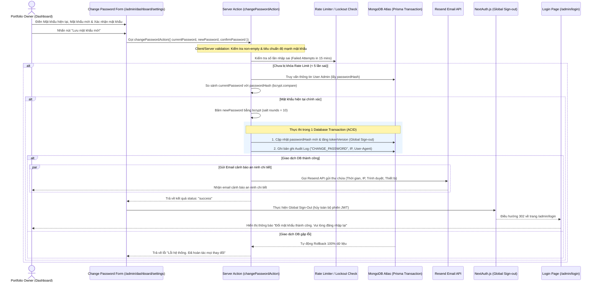
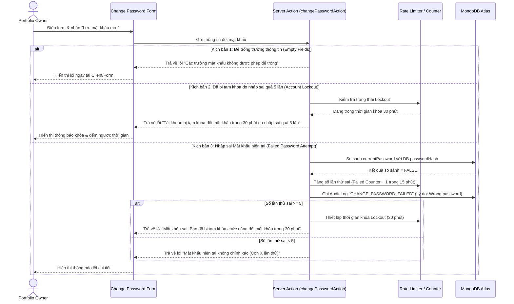

# Admin Change Password Module Flow

> [!NOTE] **EN:** Document the user flows and system interactions within this
> module using Mermaid diagrams. **VI:** Ghi chú lại luồng người dùng và tương
> tác hệ thống trong module này bằng biểu đồ Mermaid.

Tài liệu này mô tả trực quan các luồng xử lý và trình tự tương tác hệ thống
trong quá trình thực hiện thay đổi mật khẩu của Admin.

---

## 1. Luồng Đổi Mật Khẩu Thành Công (Successful Change Password Flow)

Mô tả trình tự tương tác từ khi Admin điền biểu mẫu đổi mật khẩu đến khi hệ
thống kiểm tra Rate Limit, mở Transaction băm mật khẩu, cập nhật DB, ghi Audit
Log, vô hiệu hóa phiên toàn cục và phát email cảnh báo chi tiết:

---

## 2. Luồng Xử Lý Lỗi, Lockout & Rate Limiting (Error Handling & Rate Limiting Flow)

Mô tả các kịch bản ngoại lệ khi Admin nhập thiếu trường thông tin, sai mật khẩu
hiện tại dẫn đến bị tạm khóa 30 phút:

