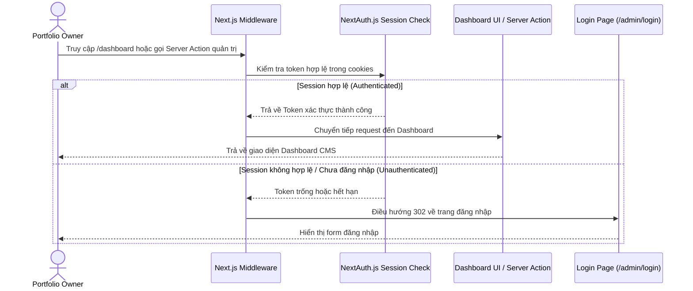
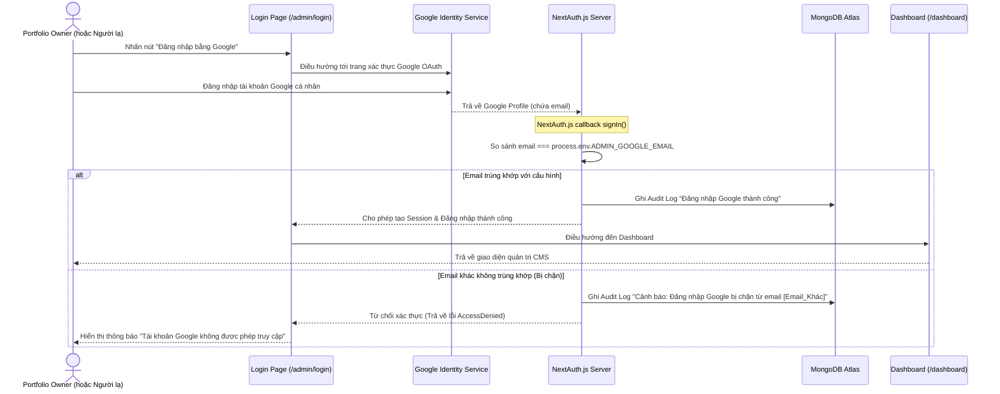
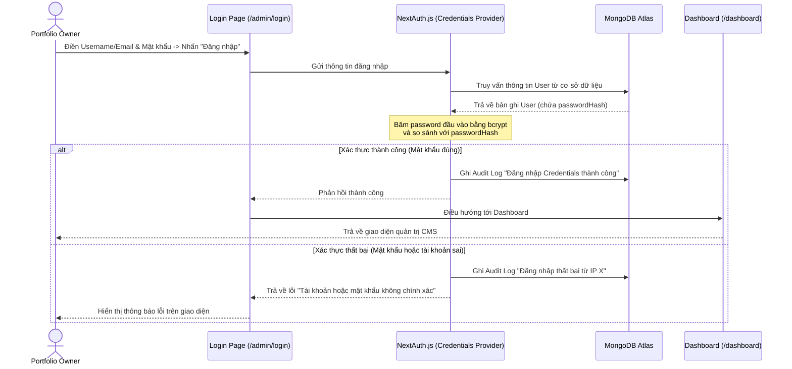
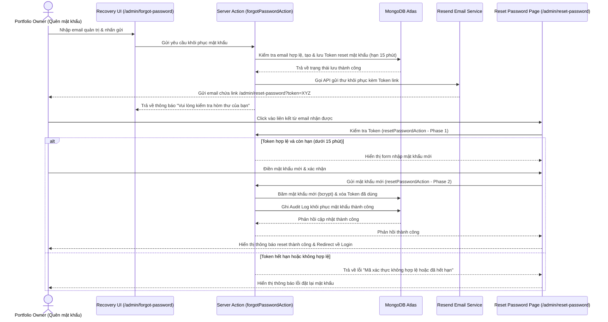

# Admin Login Module Flow

> [!NOTE] **EN:** Document the user flows and system interactions within this
> module using Mermaid diagrams. **VI:** Ghi chú lại luồng người dùng và tương
> tác hệ thống trong module này bằng biểu đồ Mermaid.

Tài liệu này mô tả trực quan các luồng xử lý và tương tác của hệ thống trong quá
trình xác thực và kiểm soát quyền truy cập của Admin.

---

## 1. Kiểm soát quyền truy cập ở Middleware (Route Guard Flow)

Next.js Middleware (`middleware.ts`) đóng vai trò là lá chắn biên, kiểm tra
trạng thái Session trước khi cho phép yêu cầu đi sâu vào hệ thống:

---

## 2. Đăng nhập qua Google OAuth 2.0 (Google Sign-In Flow)

Sơ đồ luồng đăng nhập nhanh bằng tài khoản Google, thể hiện bước callback kiểm
tra email định cấu hình (`ADMIN_GOOGLE_EMAIL`) để bảo vệ tài khoản Single-Admin:

---

## 3. Đăng nhập bằng tài khoản Credentials (Credentials Sign-In Flow)

Quy trình đăng nhập truyền thống thông qua tên đăng nhập và mật khẩu nội bộ:

---

## 4. Khôi phục mật khẩu qua Email (Password Recovery Flow)

Quy trình xử lý gửi email đặt lại mật khẩu và thực hiện cập nhật lại mật khẩu
thông qua Token an toàn:

