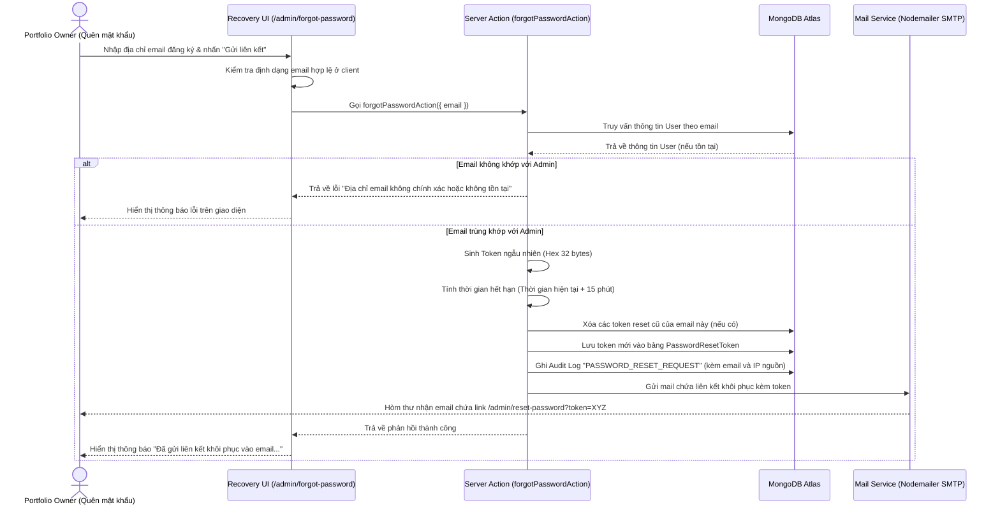
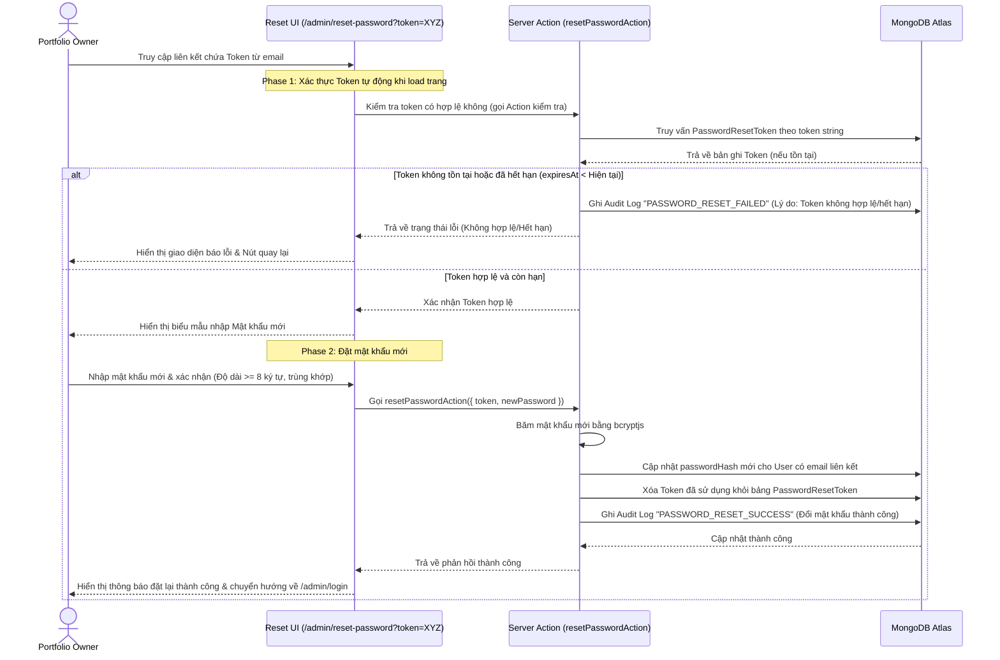

# Password Recovery Module Flow

> [!NOTE] **EN:** Document the user flows and system interactions within this
> module using Mermaid diagrams. **VI:** Ghi chú lại luồng người dùng và tương
> tác hệ thống trong module này bằng biểu đồ Mermaid.

Tài liệu này mô tả trực quan các luồng xử lý và tương tác của hệ thống trong quá
trình yêu cầu và thực hiện khôi phục mật khẩu tài khoản Admin.

---

## 1. Luồng Yêu cầu Khôi phục Mật khẩu (Forgot Password Request Flow)

Quy trình xử lý khi quản trị viên nhập email yêu cầu cấp lại mật khẩu cho đến
khi email chứa liên kết được gửi thành công:

---

## 2. Luồng Xác thực Token & Đặt lại Mật khẩu Mới (Reset Password Flow)

Quy trình xử lý khi quản trị viên nhấn vào liên kết trong email để đặt lại mật
khẩu mới:

